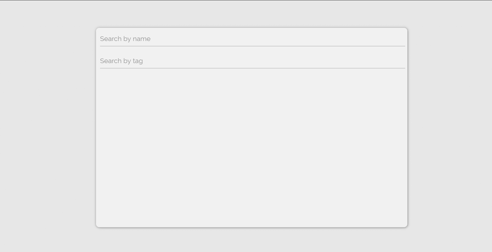

## Background:
A simple frontend user interface for interacting with an API filled with robot student profiles.
A user is able to search API for students by first and last name or through associated tags.

## Getting started:


1. Clone the repository, navigate to the root directory and enter the following into your terminal:
   ```bash
   $ npm i
  
   ```
2. Start up the parcel server by entering:

   ```bash
   $ npm start

   ```
  Server should be running on http://localhost:8000

